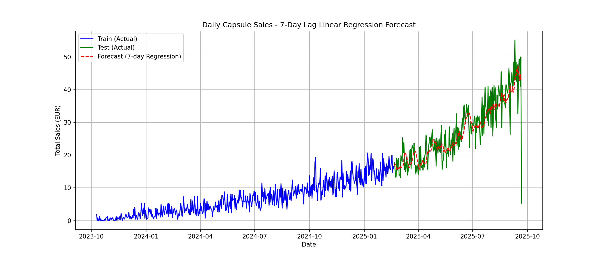

# Predicting Customer Loyalty Sales

## Overview
This project simulates a retail CRM environment and builds a time‑series forecasting pipeline to predict daily sales for capsule products. It:
- Generates realistic fake CRM data (customers, products, transactions, redemptions)
- Loads data into a SQLite database (`crm_demo.db`)
- Aggregates daily capsule sales into a time series (`daily_capsule_sales.csv`)
- Trains and visualizes two forecasting approaches:
  - 7‑day lag Linear Regression
  - Auto ARIMA

Outputs include evaluation metrics and forecast plots saved as PNG files.

## Repository Structure
- `fake_data_generator.py`: Generates CSVs in `fake_retail_data_output/`.
- `fake_retail_data_output/`:
  - `customers.csv`, `products.csv`, `transactions.csv`, `redemptions.csv`
- `crm_demo.sql`: Schema DDL for SQLite tables.
- `crm_demo.db`: SQLite database (created by you), populated from the generated CSVs.
- `time_series_generator.py`: Queries the database to produce `daily_capsule_sales.csv` time series for capsule products.
- `daily_capsule_sales.csv`: Daily aggregated EUR sales for capsule products (D‑frequency, missing days filled with 0).
- `ARIMA_Pridictor.py`: Trains 7‑day lag Linear Regression and Auto ARIMA, evaluates, and plots forecasts.
- `capsule_sales_7day_regression_forecast.png`: Regression forecast plot.
- `capsule_sales_auto_arima_forecast.png`: ARIMA forecast plot.

## Business Goal and What We Model
- **Business focus**: Track and forecast daily revenue from capsule product sales (EUR) for a coffee/retail‑like brand.
- **Time series**: `total_sales` per day for products where `product_type = 'Capsule'`.
- **Why**: Forecasts help plan inventory, marketing, and promotions targeted to capsule demand.

## Data Model and Relationships
Tables (as created by `crm_demo.sql`):
- `Customers(customer_id, join_date, loyalty_tier, age, gender, city, email)`
- `Products(product_id, product_type, model_or_flavor, flavor, intensity, price_eur)`
- `Transactions(transaction_id, customer_id, product_id, quantity, transaction_date, channel, total_amount_eur)`
- `Redemptions(redemption_id, customer_id, redemption_date, reward_type, value_eur)`

Key relationships:
- `Transactions.customer_id → Customers.customer_id` (many‑to‑one)
- `Transactions.product_id → Products.product_id` (many‑to‑one)
- `Redemptions.customer_id → Customers.customer_id` (many‑to‑one)

The time series is derived by joining `Transactions` with `Products` and summing `total_amount_eur` per day where `Products.product_type = 'Capsule'`.

## End‑to‑End Pipeline
1) Generate fake data
- Runs `fake_data_generator.py` to create CSVs under `fake_retail_data_output/`.

2) Create SQLite schema
- Create `crm_demo.db` and execute the schema in `crm_demo.sql`.

3) Load CSVs into the database
- Import the generated CSVs from `fake_retail_data_output/` into the corresponding tables.

4) Build the time series
- Run `time_series_generator.py` to query daily capsule sales and save `daily_capsule_sales.csv`.

5) Model and visualize forecasts
- Run `ARIMA_Pridictor.py` to train/evaluate the 7‑day lag Linear Regression and Auto ARIMA models and save plots.

## Setup
### Python version
- Python 3.9+ recommended

### Install dependencies
```bash
pip install -U pandas numpy matplotlib scikit-learn pmdarima
```

## How to Run
All commands below assume your working directory is the repository root.

1) Generate fake data
```bash
python fake_data_generator.py
```
This creates `fake_retail_data_output/customers.csv`, `products.csv`, `transactions.csv`, and (optionally) `redemptions.csv`.

2) Create the SQLite database and tables
- Using the sqlite3 CLI:
```bash
sqlite3 crm_demo.db ".read crm_demo.sql"
```
This creates empty tables in `crm_demo.db`.

3) Load CSVs into the database
- Still in the sqlite3 CLI, import each CSV (headers are present, so turn headers on and set the delimiter):
```sql
.mode csv
.headers on
.import fake_retail_data_output/customers.csv Customers
.import fake_retail_data_output/products.csv Products
.import fake_retail_data_output/transactions.csv Transactions
-- If you generated redemptions
.import fake_retail_data_output/redemptions.csv Redemptions
```
Exit the CLI when done:
```sql
.quit
```

4) Generate the daily capsule sales time series
```bash
python time_series_generator.py
```
- This runs a SQL query:
```sql
SELECT 
  date(t.transaction_date) AS day,
  SUM(t.total_amount_eur) AS total_sales
FROM Transactions t
JOIN Products p ON t.product_id = p.product_id
WHERE p.product_type = 'Capsule'
GROUP BY day
ORDER BY day;
```
- Then it converts to a daily frequency (fills missing dates with 0) and writes `daily_capsule_sales.csv`.

5) Train models and generate plots
```bash
python ARIMA_Pridictor.py
```
This script:
- Builds 7‑day lag features and fits `LinearRegression`
- Splits data 70/30, prints RMSE, and saves `capsule_sales_7day_regression_forecast.png`
- Fits `auto_arima` on the training split, forecasts the test window, prints RMSE, and saves `capsule_sales_auto_arima_forecast.png`

## Notes & Troubleshooting
- If `pmdarima` fails to install, ensure you have build tools available (on macOS: Xcode Command Line Tools). Alternatively, try:
```bash
pip install --only-binary :all: pmdarima
```
- The generator uses random seeds for reproducibility; adjust configuration at the top of `fake_data_generator.py`.
- If you modify the schema or CSV headers, re‑create the database and re‑import.
- `time_series_generator.py` resamples to daily frequency with zeros for missing days; adjust if you prefer forward‑fill or interpolation.

## What Success Looks Like
After completing the steps, you should have:
- `crm_demo.db` populated with 4 tables
- `daily_capsule_sales.csv` with a continuous daily index
- `capsule_sales_7day_regression_forecast.png` (Linear Regression)
- `capsule_sales_auto_arima_forecast.png` (Auto ARIMA)

These artifacts demonstrate an end‑to‑end workflow from synthetic CRM data generation through database modeling to time‑series forecasting and visualization for daily capsule sales.

## Forecast Preview (Auto ARIMA)

 